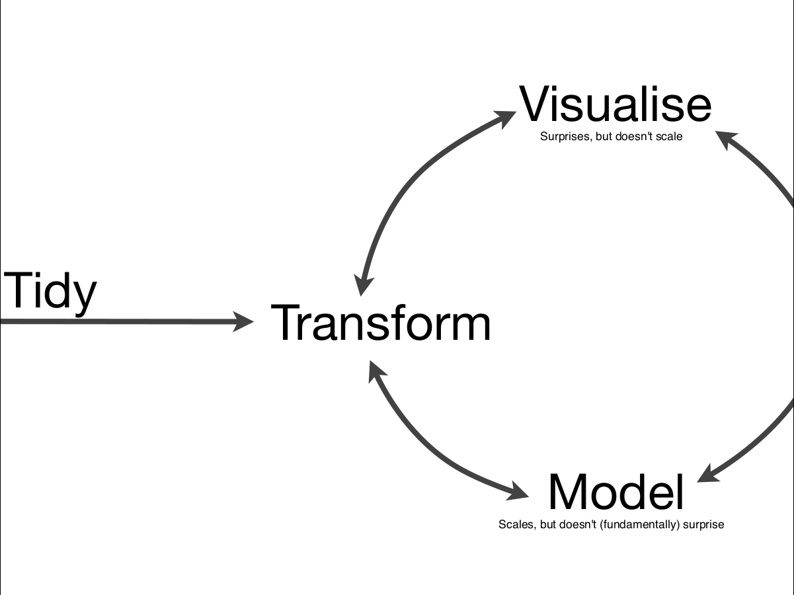

# data science



* tidying: `tidyr`
* visualization: `ggvis`
* transform: `dplyr`

# databases 

* **query plans** are a db prediction how long a query would take: [http://www.sqlite.org/queryplanner.html]()

# linux networking

**Problem:** cisco vpn reconfigures DNS server and does not restore it after disconnect.
**Indicator**: No DNS answers (no net) and something like this in `/etc/resolv.conf`:

```
nameserver 127.0.0.1
```

**Solution:** short term: edit nameserver to: `1.0.0.1`.
Long term: edit `/etc/network/interfaces`:

```bash
# after this line
iface lo inet loopback
# insert
dns-nameservers 1.0.0.1 1.1.1.1
#second one is alternate
```

then invoke:

```bash 
systemctl restart networking.service
```
