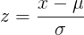

# data science


* tidying: `tidyr`
* visualization: `ggvis`
* transform: `dplyr`

## z-score  

Calculates for every datapoint,
how many standard-deviations it is away from the mean of the sample.
Can be positive (higher than the mean) and negative (lower).
Is calculated from the Mean and Standard Deviation.



**Usage:**
* compare a value relative to the others in a set 
    * together with standard distribution table: see how many values are above (relative)
* compare values, that come from different normal distributions
    * e.g.: compare maths mark to physics (when knowing the results for the whole class)
* reverse calculating which value has to be succeded to achieve to be in the top X% of the dataset

## tidy data  

Also: "tight data".
Is commonly seen in a **column-format**.
There is a column header (= variable name) and the rows contain the values.

**No:**
* rownames  
* values in column header (e.g. dates) called: cases-data
* extra distinction of variables in separate column (e.g. small/large particles)

**How:**
1. Each variable in own column.
2. Each observation in own row.
3. All observations in one table.

# databases 

* **query plans** are a db prediction how long a query would take: [http://www.sqlite.org/queryplanner.html]()

# linux 

## networking

**Problem:** cisco vpn reconfigures DNS server and does not restore it after disconnect.
**Indicator**: No DNS answers (no net) and something like this in `/etc/resolv.conf`:

```
nameserver 127.0.0.1
```

**Solution:** short term: edit nameserver to: `1.0.0.1`.
Long term: edit `/etc/NetworkManager/NetworkManager.conf`:

```bash
# after this lines
[main]
plugins=ifupdown,keyfile,ofono
# insert
dns=dnsmasq
```

then invoke:

```bash 
sudo service network-manager restart
```

## grub

**Problem:** display distortions with Jennys netbook (graphics chip: *Intel GMA 950*)
**Solution:** 

1. Breakup a startup after grub to force it to display grub-screen on next startup.
2. Select the linux start entry and edit with: `e`.
3. insert `i915.modeset=1` in front of `quiet` in kernel start line
4. Continue the start.
